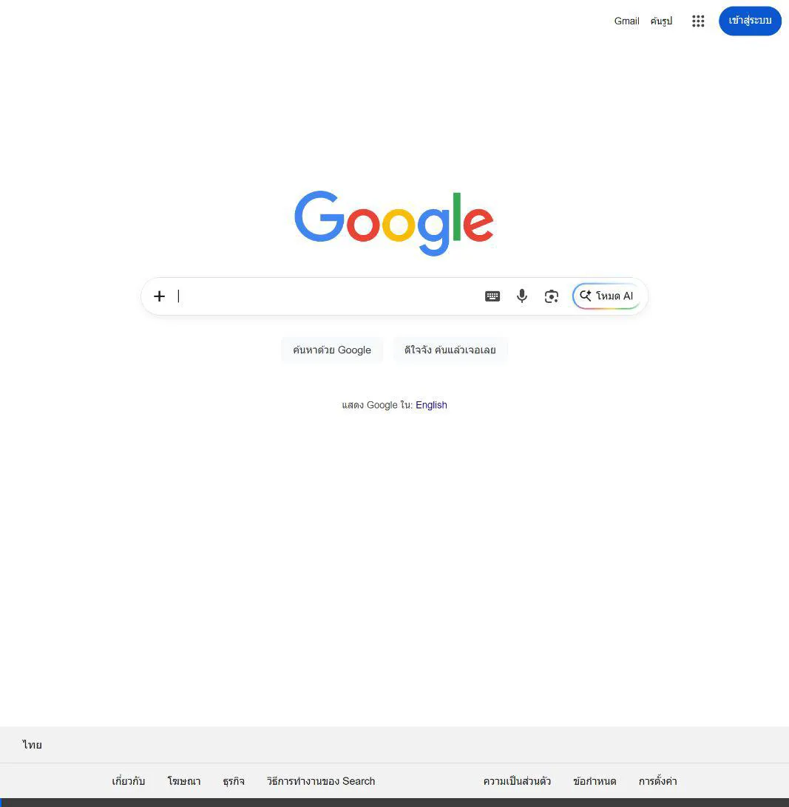
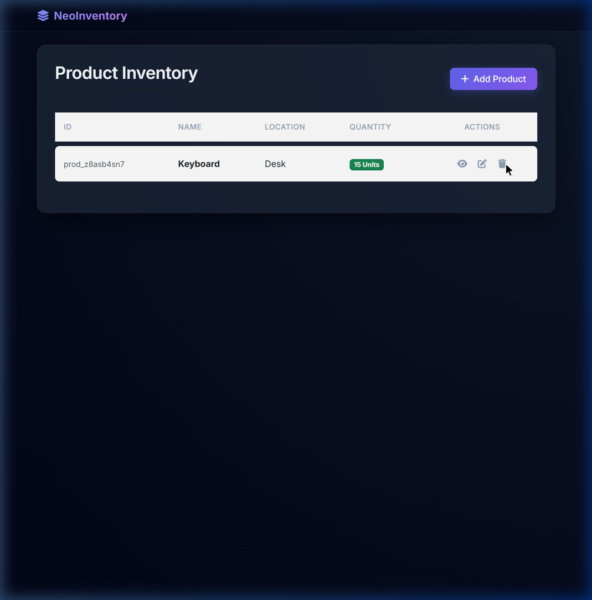

# NeoInventory Walkthrough

## What I Accomplished
I created a beautiful, robust inventory management application named **NeoInventory**. It is built without modern frameworks and without TypeScript, but instead uses a tailored combination of HTML, Javascript with jQuery, and pure CSS (via Bootstrap 5 utilities supplemented with custom CSS).

### Key Features Implemented:
- **Product Listing:** A sleek, glassmorphism-styled table that displays all inventory items prominently with custom badge coloring based on stock quantity.
- **Add Product:** A modal form validating and pushing new objects (Id, Name, Description, Quantity, Location) to the list.
- **View Details:** An eye-icon button expanding all item information.
- **Editing:** Pre-filled details in the edit modal, seamlessly saving back to the application state without unorganized duplication.
- **Persistent Storage:** A LocalStorage-based service logic handling state creation, updates, storage, and retrieval upon page load.
- **Responsive Premium Design:** Utilized gradient themes and deep dive pseudo-CSS interactions to wow users, avoiding a basic simple setup.

## Testing Performed
Using a specialized browser subagent, the following end-to-end integration flows were sequentially verified:
1. Validating the "Empty State" message rendering logic.
2. Clicking the "Add Product" button, providing valid inputs (`Name: Keyboard`, `Quantity: 5`, `Location: Desk`), and checking the updated table status.
3. Engaging the View Details button and confirming proper dynamic IDs appended to UI blocks.
4. Testing inline Edit functions changing "5 units" to `15` units, confirming the green "Units" badge rendered properly.
5. Deleting the created record and validating it resets to the "Empty State".

## Verification Results
All features act harmoniously and successfully interact with `localStorage`. No page reload data losses or UI layout breakages were detected.

## Visual Evidence
Below is a step-by-step recording of the testing process interacting with the completed app:

And here is a screenshot of the premium user interface right before item deletion:

